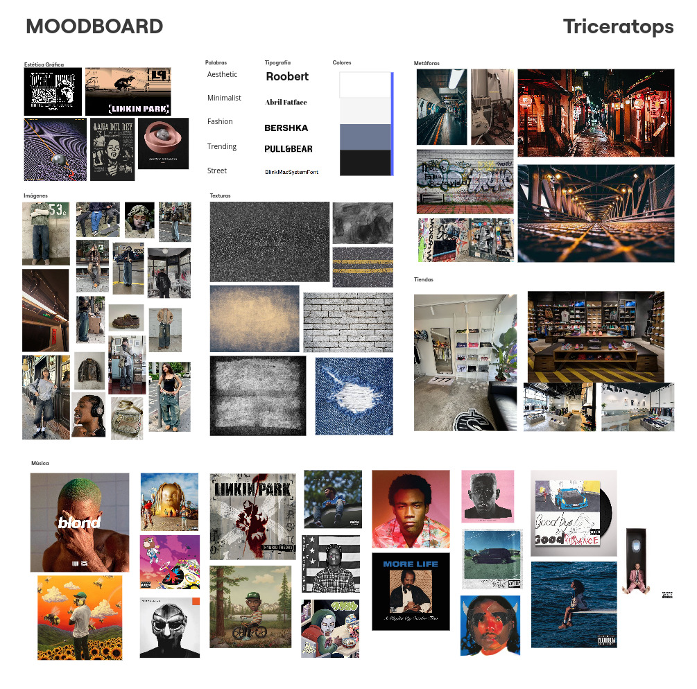

# Project - E-commerce Website Clothing Store

## Index

- [Project - E-commerce Website Clothing Store](#project---e-commerce-website-clothing-store)
  - [Index](#index)
  - [Description](#description)
  - [User Manual](#user-manual)
    - [Prerequisites](#prerequisites)
      - [Dependencies Installation For App Web](#dependencies-installation-for-app-web)
        - [Additional Packages Included In Web App](#additional-packages-included-in-web-app)
      - [Dependencies Installation For API](#dependencies-installation-for-api)
        - [Additional Packages Included In API](#additional-packages-included-in-api)
      - [Running the Project](#running-the-project)
  - [Design](#design)
    - [Brand Identity](#brand-identity)
    - [System Architecture](#system-architecture)
      - [Navigation](#navigation)
    - [Mockups](#mockups)
  - [Additional Information](#additional-information)
    - [Data](#data)
    - [Linter](#linter)

## Description

This project is an e-commerce website designed for a clothing store, the objective is allowing users to browse, select, and purchase clothing items in an intuitive and efficient manner. The primary focus of this first project step is to create a user-friendly and visually appealing interface while implementing best practices in web development. The functionality of the website will be implemented in subsequent project steps.

## User Manual

### Prerequisites

Before running the project, ensure you have the following installed on your machine:

- Node.js: You need to have Node.js installed, which includes npm (Node Package Manager). You can download the latest version of Node.js from the [official website](https://nodejs.org/en). To verify that Node.js and npm are installed correctly, you can run the following commands in your terminal:

~~~bash
node -v
npm -v
~~~

These commands should return the version numbers of Node.js and npm.

#### Dependencies Installation For App Web

Navigate to projects/project-01/ and run the command:

~~~bash
npm install
~~~

This command will install all necessary dependencies, including the packages and configurations in the next section.

##### Additional Packages Included In Web App

- `bootstrap`: Front-end framework that provides a collection of pre-designed HTML, CSS, and JavaScript components for building responsive and mobile-first web applications. You can see the documentation [here](https://getbootstrap.com/docs/5.0/getting-started/introduction/).

- `react-bootstrap`: Is a library that allows you to use Bootstrap components as React components. It reimplements Bootstrap's JavaScript components in a way that is compatible with React, enabling the possibility to take advantage of Bootstrap's styling and layout features while adhering to React's declarative programming style. You can see the documentation [here](https://react-bootstrap.netlify.app/docs/components/accordion).

- `react-router-dom`: This library is used for routing within the application. You can see the documentation [here](https://reactrouter.com/en/main).

- `zustand`: Zustand is a library for global state management in React applications. It is ideal for storing and managing the global state of the application, such as user session data, user preferences, and other states that need to be accessible from various parts of the application. You can see the documentation [here](https://zustand.surge.sh/).

- `React Query/TanStack`: This library is designed for data fetching, caching, and synchronization in React applications. It simplifies the management of data states that come from APIs and external sources, efficiently handling data synchronization and updates. It is particularly useful for implementing pagination, infinite scrolling, and providing feedback to users during loading states. You can see the documentation [here](https://react-query.tanstack.com/).

- `Axios`: Axios is a promise-based HTTP client for JavaScript that simplifies the process of making HTTP requests from the browser. It is used to fetch data from APIs and external sources, providing a simple and efficient way to handle data retrieval and manipulation. You can see the documentation [here](https://axios-http.com/docs/intro).

- `Sonner`: Sonner is a library for generate feedback messages in the application. You can see the documentation [here](https://sonner.emilkowal.ski/).

#### Dependencies Installation For API

Navigate to projects/api/ and run the command:

~~~bash
npm install
~~~

This command will install all necessary dependencies, including the packages and configurations in the next section.

##### Additional Packages Included In API

- `express`: Express is a minimal and flexible Node.js web application framework that provides a robust set of features for web and mobile applications. It is used to create APIs, handle HTTP requests, and define routes for data retrieval and manipulation. You can see the documentation [here](https://expressjs.com/).

- `cors`: CORS is a Node.js package that provides a middleware for Express applications to enable Cross-Origin Resource Sharing (CORS). It allows the server to handle requests from different origins, enabling the client-side application to access resources from different domains. You can see the documentation [here](https://expressjs.com/en/resources/middleware/cors.html).

- `dotenv`: Dotenv is a zero-dependency module that loads environment variables from a .env file into process.env. Storing configuration in the environment separate from code is based on The Twelve-Factor App methodology. You can see the documentation [here](https://www.npmjs.com/package/dotenv).

- `bcrypt`: Bcrypt is a library for hashing passwords in Node.js applications. It provides a secure way to store and manage user passwords by encrypting them using a one-way hashing algorithm. You can see the documentation [here](https://www.npmjs.com/package/bcrypt).

- `jsonwebtoken`: Jsonwebtoken is a library for generating JSON Web Tokens (JWT) in Node.js applications. It is used to create secure authentication tokens that can be used to verify the identity of users and provide access to protected resources. You can see the documentation [here](https://www.npmjs.com/package/jsonwebtoken).

- `zod`: Zod is a TypeScript-first schema declaration and validation library. It is used to define the structure of data objects and validate their contents, ensuring that the data conforms to the specified schema. You can see the documentation [here](https://zod.dev/).

- `google-auth-library`: Google Auth Library is a library for authenticating users with Google services in Node.js applications. It provides a secure and reliable way to authenticate users using Google accounts, enabling access to Google APIs and services. You can see the documentation [here](https://www.npmjs.com/package/google-auth-library).

- `morgan`: Morgan is a Node.js middleware for logging HTTP requests and responses. It provides detailed information about the incoming requests and outgoing responses, including the request method, URL, status code, response time, and other relevant data. You can see the documentation [here](https://www.npmjs.com/package/morgan).

- `jest`: Jest is a JavaScript testing framework designed for simplicity and ease of use. It is used to write unit tests, integration tests, and end-to-end tests for Node.js applications, providing a comprehensive suite of tools for testing and debugging code. You can see the documentation [here](https://jestjs.io/).

- `supertest`: Supertest is a library for testing HTTP requests in Node.js applications. It provides a simple and intuitive API for making HTTP requests and asserting the responses, enabling the creation of automated tests for APIs and web services. You can see the documentation [here](https://www.npmjs.com/package/supertest).

#### Running the Project

To run the project, first navigate to projects/api/ and run the command:

~~~bash
npm run start:local
~~~

This command will start the API server on port 3000. The API server will be running locally, and you can access the endpoints by sending HTTP requests to <http://localhost:3000>.

Then, navigate to projects/project-01/ and run the command:

~~~bash
npm run dev
~~~

This command will start the development server for the web application.

Finally, open your browser and navigate the link shown in the terminal. The project will be running on a local server, and you can interact with the website.

## Design

### Brand Identity

The brand identity of our website is centered around the concept illustrated in the mood board:

Our brand is called ***Tricer***, and it draws inspiration from this mood board, which aims to represent an urban street style. The design reflects a strong musical influence, incorporating cool colors to create a vibrant and contemporary aesthetic that resonates with our target audience.

### System Architecture

The current system is designed as a Single Page Application (SPA) using react-router-dom to handle navigation between the different views of the platform without the need to reload the page. This allows for a smooth and fast user experience, where the different sections of the store, such as the product catalog, product details, and categories, are dynamically loaded based on the defined routes. Each view or page is represented as a React component, and the architecture facilitates the reuse of components and quick adaptation for the deployment of future functionalities or integration with real APIs.

The backend architecture was built as a REST API from scratch using Node.js and Express.js. This API strictly adheres to REST principles, maintaining a stateless nature where clients must provide all necessary information for the server to process their requests appropriately. Each resource, such as products and users, is handled independently through dedicated routes, making proper use of HTTP verbs like GET, PUT, POST, and DELETE.

The development team implemented a Model-View-Controller (MVC) architecture, establishing a clear separation of responsibilities. This architectural decision provides excellent scalability and makes future modifications straightforward. For instance, changing the database model can be accomplished with minimal code adjustments, thanks to the implementation of dependency injection patterns. This allows seamless switching between different models (such as local storage or database storage) by simply executing the corresponding script.

To ensure reliability, the entire API includes comprehensive validation and testing coverage. All functionalities and data inputs are validated using Zod schemas, which provide runtime validation capabilities. Both unit and integration tests have been implemented, ensuring that each component of the API functions precisely and reliably as intended.

#### Navigation

The navigation of the website is structured as follows the diagram below:

### Mockups

You can see the mockups of the website in the following link of Figma: [TricerStoreMockups](https://www.figma.com/design/IrHRSZP4JTKU3gjFCipxq3/Proyecto-%231---Tienda-de-Ropa?node-id=0-1&node-type=canvas).

## Additional Information

### Data

For now, this project uses mock data to simulate the behavior of a real e-commerce website. The data is stored in JSON files acceded by the API. This data includes detailed information about clothing items, such as item names, descriptions, prices, image URLs and also the users session data. The JSON data is utilized to populate the website with clothing items, allowing users to browse and interact with a simulated shopping experience.

The images used in the project are sourced from [Pull&Bear](https://www.pullandbear.com), and all rights to these images belong to their respective owners. In future iterations of the project, this mock data will be replaced with a database to create a fully functional e-commerce platform.

### Linter

The project uses [ESLint](https://eslint.org/S) for code linting, and we follow the [StandardJS](https://standardjs.com/) style guide, which enforces a set of rules for writing clean and consistent JavaScript code. The ESLint configuration file is located at projects/project-01/.eslintrc.js. This configuration includes the following rules:

~~~text
Use single quotes (') for strings.
Do not use semicolons (;).
Indentation should be set to 2 spaces.
~~~

***

Return to [Assignments Documentation](../../../README.md).
